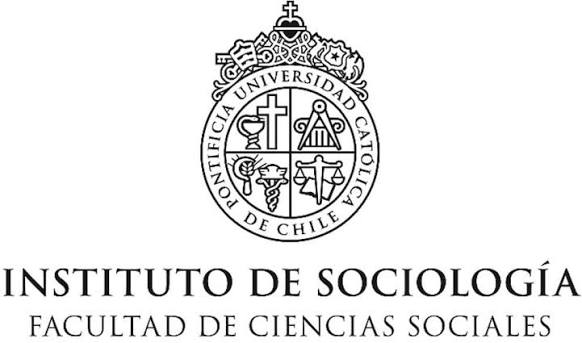
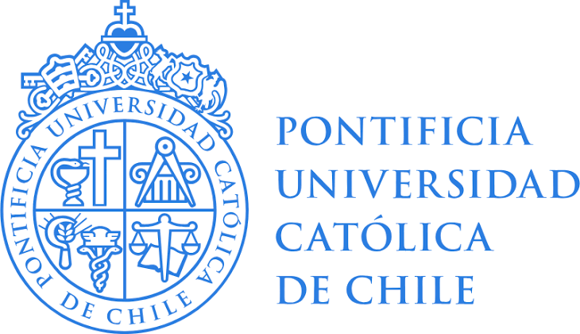

RaizQA y sus desarrolladores agradecen al **Instituto de Sociología UC (ISUC)** y a la **Pontificia Universidad Católica de Chile** por las oportunidades y el apoyo económico brindado para el desarrollo de este software.

Su respaldo ha sido fundamental para poder construir una herramienta de análisis cualitativo abierta, gratuita y pensada para la comunidad académica.

Puedes encontrar más información sobre el ISUC en su web [sociologia.uc.cl](https://sociologia.uc.cl/).

::: {.sponsor-logos}
{.sponsor-logo}
{.sponsor-logo}
:::
