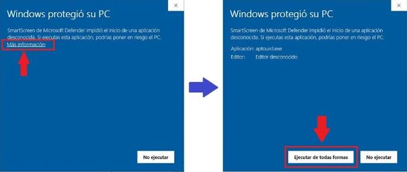

## Instalar en Windows

Descarga la última versión disponible: **RaizQA v1.0piloto**

[Descargar RaizQA.exe](https://github.com/Lorenzo-Vives/RaizQA/releases/download/v1.0piloto/RaizQA.exe){.btn-primary}

⚠️ Nota: Windows puede mostrar una advertencia. Usa "Más información" → "Ejecutar de todas formas".

{.install-screenshot}

## Instalar en Mac

## Instalar en Linux

Para instalar RaizQA en Linux desde cero, clona el repositorio y monta un entorno virtual de Python siguiendo estos pasos:

```bash
# 1. Clonar el repositorio del proyecto
git clone https://github.com/Lorenzo-Vives/RaizQA.git

# 2. Entrar a la carpeta del proyecto
cd RaizQA

# 3. Crear un entorno virtual
python3 -m venv venv

# 4. Activar el entorno virtual
source venv/bin/activate

# 5. Instalar las dependencias
pip install -r requirements.txt

# 6. Ejecutar la aplicación
python main.py
```

::: {.callout-note}
## Versiones en desarrollo
Las versiones menos estables —que incorporan pruebas y nuevas funciones antes de su lanzamiento oficial— están disponibles en el [repositorio de GitHub de RaizQA](https://github.com/Lorenzo-Vives/RaizQA).
:::
